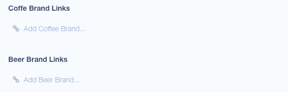
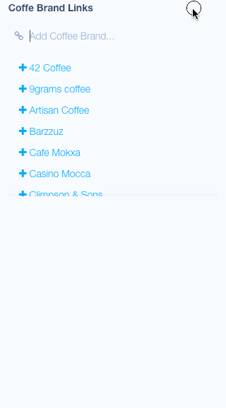

# Link Field for [Cockpit](https://github.com/aheinze/cockpit/tree/next)

**Proposal for Links field. Experimental, please use with caution.**

This field requires Cockpit Next (right now current version is in [COCOPi](https://github.com/COCOPi/cocopi-kickstart) project).

Allows you to link collections with other collections (`has many` & `has one` relationship) in one direction (parent to child).

You can also specify which colelctions to link (single or multiple) or create children from parent and link them automatically.

##### Autocomplete Mode:



##### List Mode:



## Installation

```
$ cd cockpit/modules/addons
$ git clone git@github.com:attitude/field-link.git
```

_Note: Directory must be named **field-link** for Cockpit to register addon._

## Usage

In collection fields edit mode set `LINK` as field type.

**Update tag:** `$npm run build` requires [riot pre-compiler](http://riotjs.com/guide/compiler/#pre-compilation) to be installed on working machine.

##### Options:

| Paramenter  | Type            | Description
|:------------|-----------------|:---------------------------------------------
| placeholder | *string*        | Replaces default `Add Link...` placeholder
| collections | *string\|array* | Sets which collections to link, not set by default, meaning any existing collection can be linked
| hasOne      | *boolean*       | Forces one-to-one relationship, default is `false`
| createNew   | *string*        | Collection slug for new entries, not set by default
| list        | *boolean*       | List and filter available collections to link (disables autocomplete)

#### Examples

`Add Beer...` placeholder, `collections` attr as string, creates new entry for `beers` inline.

```json
{
    "placeholder": "Add Beer...",
    "collections": "beers",
    "createNew": "beers"
}
```

`Add drink...` placeholder, allow multiple `collections`, attr as comma separated values:

```json
{
    "placeholder": "Add Drink...",
    "collections": "beers, wines, coffees"
}
```

`Add drink...` placeholder, allow multiple `collections`, attr as array values:

```json
{
    "placeholder": "Add Drink...",
    "collections": ["beers", "wines", "coffees"]
}
```

Restrict to single country:

```json
{
    "placeholder": "Add Country...",
    "collections": "countries",
    "hasOne": true
}
```


## Creating new entries inline

By default, child link must exist prior the linking. You can however use `createNew` attribute to create new children while editing parent.

Set `createNew` attribute, e.g. `{"createNew": "beers"}`, where `beers` is existing collection slug. New child will be create using Ajax.

New link is created with `name` and `title` attributes set as the input value. Newly created `_id` is than pushed into the link array.

#### Examples

Allows to create new car brands:

```json
{
    "placeholder": "Add Cars...",
    "collections": "cars",
    "createNew": "cars"
}
```

## Known Issues

1. Autocomplete needs reload to trigger for links created inline to work properly
1. Tested on Chrome

Feel free to test it and let me know [@martin_adamko](https://twitter.com/martin_adamko) how works for you. Feel free to open issue if you find one.

Enjoy!
